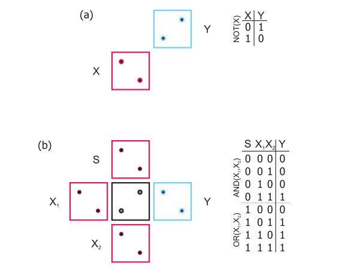

## Uvod

*Procesne platforme* - medij s katerim je mogoče upravljati nadzorovano in je zmožen pomnjenja, odločanja in prenosa podatkov. 

*Procesne metode* - koncept procesiranja nad podatki.

Trenutno prehajamo iz dobe namiznega računalništva v dobo vseprisotnega računalništva (značilna je razpršenost procesnih platform), s tem se porajajo dileme o bodočnosti procesne platforme. 

## Nanotehnologije in nanoračunalništvo

Nadzorovano manipuliranje z delci velikostnega reda nanometra (elektroni, atomi, molekule, dna,...). 

Dva segmenta raziskav: 
 
 - tehnološki - analiza možnosti izdelave materialov bodočnosti
 - procesni - implementacija nadzorljivih dinamičnih procesov v nanomaterialih

 *Nanoračunalništvo* - iskanje procesne platforma bodočnosti

## Mooreov zakon

Glede na hitrost razvoja mikro elektronike napoveduje podvojevanje kompleksnosti integriranih vezij približno vsaki 2 leti. 

V letih od nastanka zakona razvoj vezij poteka vdveh fazah *scaling up* (večje število tranzistorjev) in *scaling down* (zmanjševanje velikosti tranzistorjev). 

Danes Moore izpostavi dve omejitvi za nadljni razvoj tranzistorjev: *hitrost svetlobe* in *obvladovanje nano entitet* 

## Željene lastnosti procesne platforme bodočnosti

- *energetska varčnost* - smiselno je ramzišljati o platformah, ki bi primarno energijo zajemale iz obnovljivih virov
- *zanesljivost delovanja* - platforma mora delovati vsaj tako zanesljivo kot obstoječi elektronstki računalnik
- *možnost nadzora nad delovanjem*
- *možnost pospeševanja delovanja* 
- *možnost neposrednega prehoda na dvostanjsko procesiranje z opcijo naknadne vpeljave večstanjskega procesiranja* - backwards compatibility
- *cena* - prehod mora biti cenovno sprejemljiv
- *možnost razgradnje oz ponovne uporabe* 

## Trenutno aktualne platformno *odvisne* nekonvencionalne metode procesiranja

- QCA - kvantni celularni avtomati
- mikro/nano elektro mehanski sistemi
- DNA procesiranje
- optično procesiranje
- reakcijsko difuzijsko procesiranje

## Trenutno aktualne platformno *neodvisne* nekonvencionalne metode procesiranje

- kvantno procesiranje
- amorfno procesiranje
- reverzibilno procesiranje
- večstanjsko procesiranje
- analogno procesiranje
- naravno procesiranje

---

 # Kvantni celični avtomati

## Arhitektura QCA celice

Temelj QCA predstavlja kvantna ali QCA celica. Posamezna celica je kvadratne oblike, pri čemer se pri vsake ogljišču kvadrata nahajakvantna pika s pozitivnim nabojem. V celici sta ujeta dva elektrona, pike so povezane s kanali, po katerih lahko elektrona potujeta. Elektron se premakne glede na zunanji vpliv oz. glede na vpliv drugega elektrona v celici. Elektrona bosta vedno v nasprotnem ogljišču in nikoli na isti stranici (razen v fazi prehajanja). Elektrona vedno iščeta maksimalno razdaljo med sabo.

QCA celic ne moremo smatrati kot pomnilni element, ker lahk oves čas prehajajo med stanji na osnovi kvantnih zakonov.

Težava: majhna razlika med energijami polariziranih in nepolariziranih stanj v celicah, kar pomeni da so celice zelo izpostavljene vplivu okolja in šumu.

## Strukture QCA celic

Pri snovanju QCA struktur se zatekamo k homogenim porazdelitva celic v dvo ali trodimenzionalnem prostoru. QCA celice, ki tvorijo QCA strukture delimo v tri skupine: vhodne celic, notranje (procesne) celice in izhodne celice

## Osnovni gradniki za dvovrednostno procesiranje v QCA strukturah

## Vpeljava ure v QCA strukture

Da se izognemu trčenju več podatkovnih vrednosti, vpeljemo uro. To naredimo tko, da začasno zaklepamo dinamiko v poseznihnotranjih celicah, s čimerje prehajanje elektronov v stabilne lege začasno onemogočeno. Ura definira 4 faze:

- *switch* - pregrade med tuneli se zapirajo in celice prehajajo v polarizirana stanja
- *hold* - pregrade so zaprte in celice ostajajo v polariziranih stanjih
- *release* - pregrae med tuneli se odpirajo in elektroni začnejo prehajati med pikami
- *relax* - pregrade med tuneli so odprte in celice so proste -> prihaja do sprememb polarizacije

Vse 4 faze skupaj tvorijo eno urino periodo. Običajno QCA strukture razdelimo na posamezna urina področja, tako si da vse celice v enem področju delijo isto fazo ure. 

---

# Reverzibilno procesiranje

Procesiranje v splošnem smatramo za abstraktno interpretacijo dinamičnega fizičnega procesa v kontekstu njegovih stanj in prehajanja med njimi. Osnove za izvedbo procesiranja:

- obstajati mora robustna preslikava med modelom procesiranja in fizičnim sistemom
- fizični sistem in njegov model moramo pred delovanjem inicialirizirati
- po inicializaciji model začne spreminjati svoja stanja in pri tem lahko doseže neko končno stanje

## Reverzibilnost dinamičnega procesa

Za reverzibilen proces smatramo vsak proces, ki omogoča obrnljivost dinamike opazovanega procesa. To pomeni, da ob prehodu iz prvega stanja v drugo, informacija o prvem stanju ni izgubljena ampak konzervirana v času.

Ločimo med *fizično* in *logično* reverzibilnostjo.

## Reverzibilnost logičnih funkcij

Reverzibilnost procesiranja je metodološki pristop, ki posega na nivo enostavnih logičnih funkcij. 

Logična funkcja je reverzibilna, če:

- je število vhodnih spremenljivk enako številu izhodnih spremenljivk
- vsak vektor vhodnih vrednosti se preslika v njemu lasten vektor izhodnih vrednosti, ki je tako edinstven in drugačen od ostalih

Iz tega sledi, da mora biti funkcija bijektivna in imeti enako število vhodov in izhodov. 

Funkcije, ki niso reverzibilne lahko dopolnimo: z dodatnimi vhodnimi spremenljivkami ali z redundatnimi izhodnimi spremenljivkami. 

## SWAP in feynmanova funkcija

SWAP je funkcija, ki prejme dva vhoda in ima dva izhoda. Njen namen je, da zamenja vrednosti vhodnih spremenljivk. Je reverzibilna.

Feynmanova funkcija, imenovana tudi CNOT. Kjer imamo dva vhoda (A, B) in dva izhoda. Prvi izhod je enak prvemu vhodu, drugi izhod je pa ena A XOR B.

Toffolijeva funkcija. Trivhodna CNOT funkcija, kjer prva dva vhoda preslikamo na izhod, tretji izhod je pa enak (AB) XOR C.

Fredkinova funkcija. Controled SWAP funkcija. 

Toffolijeva in Fredkinova predstavljata poln funkcijski nabor.

## Motivacija za vpeljavo reverzibilnosti procesa

Energetsko efektivnejša izraba platforme. Reverzibilno procesiranje omogoča poljubno zamnjševanje izgubljene energije. Osnovni cilj ki ga skuša reverzibilnost doseči je *informacijsko brezizgubno procesiranje*. 

---

# Kvantno procesiranje

Kvantno procesiranje je definirano kot kakršnokoli procesiranje, ki ga vrši kvantni računalnik, delovanje kvantnega računalnika temelji na zakonih *kvantne fizike/mehanike*. 

*Superpozicija* - nek delec je lahko istočasno v več stanjih hkrati.

*Kvantni računalnik* - je kakršnakoli procesna naprava, ki izkrišča fenomene kvantne mehanike za izvajanje operacij nad podatki.

## Qubit

Qubit je osnovna entiteta procesiranja, pomnjenja in prenašanja v kvantnem sistemu z dvema osnovnima kvantnima stanjema.